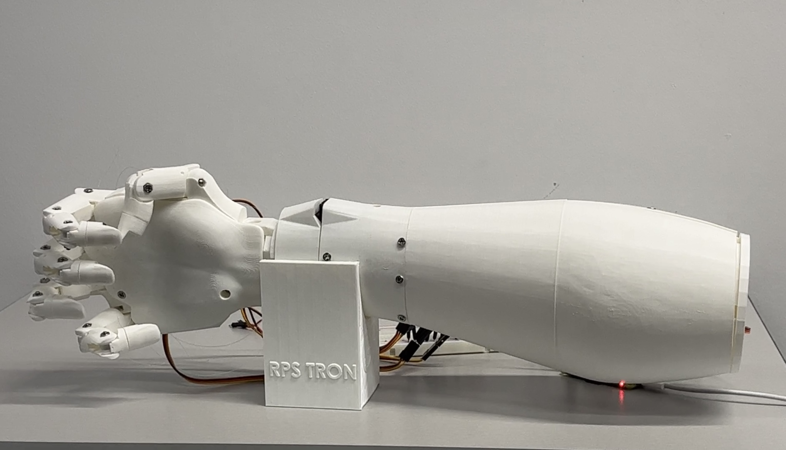

# Rock-Paper-Scissors-Tron (RPS-TRON) Hand Gesture CNN

This repository contains the Machine Learning component of the RPS-TRON project. It houses a Convolutional Neural Network designed to proficiently classify hand gestures as either 'rock,' 'paper,' or 'scissors'.

## Video Demonstration

[](https://youtu.be/thhxIV0cgXo?si=FxjFKz3m8_ArCqI6 "RPS-TRON Video Demonstration - Click to Watch!")

## Installation

1. **Python:** Ensure that Python >= 3.8 (with pip) is installed

2. **PyTorch and Torchvision:** Install PyTorch and Torchvision by following the instructions on the official website: [PyTorch Installation Guide](https://pytorch.org/get-started/locally/)

3. **Pillow (PIL):** Pillow is a fork of the Python Imaging Library (PIL) that adds support for more image file formats. Install it using pip:

```bash
pip install Pillow
```

4. **Matplotlib:** Matplotlib is a plotting library. Install it using pip:

```bash
pip install matplotlib
```

## Usage

1. Clone this repository:

```bash
git clone https://github.com/eomielan/rps-tron-gesture-cnn.git
```

2. Install the required dependencies as mentioned in the Installation section.

3. Training the Model:

   Choose one of the following methods to train the model:

   - **Using the Bash Script (`train_model.sh`):**

      To train the model using the provided Bash script, follow these steps:

      - Open a terminal within the repository.
      - Navigate to the directory where the script is located.
      - If needed, the script will automatically install nbconvert using pip.
      - Make the script executable with the command: `chmod +x train_model.sh`
      - Run the script with the command: `./train_model.sh`

      This will initiate the training procedure and generate the necessary output.

   - **Using the Jupyter Notebook (`train.ipynb`):**

      To train the model using the Jupyter Notebook, follow these steps:

      - Open the Jupyter Notebook environment in your web browser or in vscode.
      - Navigate to the `src` folder.
      - Find and open the `train.ipynb` notebook.
      - Inside the notebook, select "Run" from the Jupyter toolbar and choose "Run All Cells."

      This will execute all the cells in the notebook, which includes the training procedure.

4. Running the Software:

   To use the trained model software, follow these steps:

   - Open a terminal within the repository.
   - Navigate to the directory containing the main.py file.
   - Run the command: `python main.py image_filepath.jpg`

   Replace `image_filepath.jpg` with the complete path to the image file you want to process. The software will use the trained model to classify the provided image as rock, paper, or scissors.
